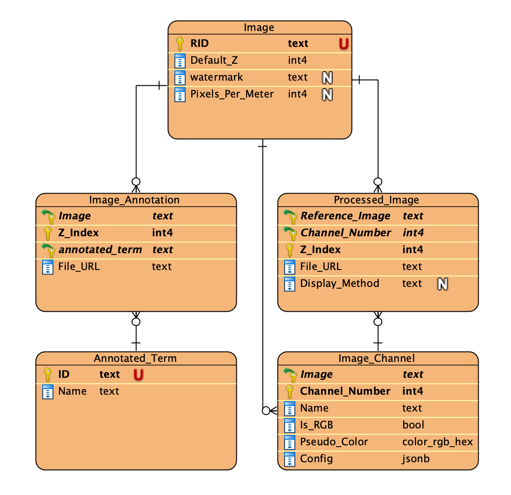

# Viewer app configuration file: viewer-config.js

Upon loading the viewer app, it will make several requests for populating
the data for different portions of the page. To avoid hard coding the requests
we've deployed a configuration mechanism in this app.

## Model

Before explaining the `viewer-config.js`, let's go over the model.
The following is the assumed model of a fully-configured viewer app:



(All the table and column names are configurable and are explained in the next section)

- `Image` table is the entry point of the viewer app.
- The `Consortium` table is optional. It's only used for extracting the watermark.
  The watermark will be displayed in the image screenshot.
- `Processed_Image` table is the actual table that stores the data for each image channels
  in each z-plane. For example if there's a image with two stored z-indices and that has
  two channels, there will be 4 records of `Processed_Image` table.
- `Image_Channel` table stores the channel information (whether it's greyscale,
  the pseudo color, name,)
- `Image_Annotation` table stores the annotations. It MUST have an asset column that
  will be used for storing the annotation files.

## Configuration

To allow flexibility, the configuration file can have multiple configurations.
Each configuration is specified by a given key name. When users navigate to
the viewer app, we will use the `config` query parameter to figure out which
configuration we should use.

The configuration file must be defined under `viewer/viewer-config.js` and the following is the structure of this config file:
```javascript
var viewerConfigs = {
  <config-name>: <configuration>
};
```
> The variable MUST be defined exactly this way. Viewer app uses this `viewerConfigs` global variable.

Where
- `<config-name>` is a string that will be matched with the given `config` query parameter.
  - `"*"` can be used to indicate the default configuration. If the query parameter is missing or wasn't found, this configuration will be used.
- `<configuration>` can be either
  - another `<config-name>` to indicate that chaise should the configuration defined under another `<config-name>`
  - or an object that its structure is explained in the [parameters](#parameters) section.


For example, let's assume the following is how the `viewer-config.js` looks like:

```javascript
var viewerConfigs = {
  "*": <config1>,
  "img1": "img2",
  "img2": <config2>
};
```

Then:
1. Navigating to a page with `?config=img1` query parameter will use `<config2>`.
2. Navigating to a page with `?config=img2` query parameter will also use `<config2>`.
3. Navigating to a page without any `config` query parameters, or with `config`
query parameters other than "img1" and "img2", will ues `<config1>`.

### Parameters

The parameters are explained in the [`viewer-config-sample.js`](https://github.com/informatics-isi-edu/chaise/tree/master/viewer/viewer-config-sample.js) file.
